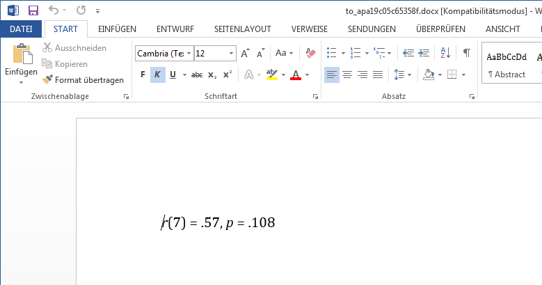

```{r, warning=FALSE, echo=FALSE}
library(apa)
```

The `*_apa()` functions help you to format outputs of statistical tests according to guidelines of the APA (American Psychological Association).

The functions take the return value of a test function as the first argument, e.g. a call to `chisq.test()` is passed to `chisq_apa()`, which returns a formatted string.

The idea of such formatters was introduced in the [schoRsch package](https://cran.r-project.org/package=schoRsch/). apa generalizes this idea by providing formatters for different output formats (text, Markdown, RMarkdown, HTML, LaTeX, docx and R's plotmath syntax).

Currently supported tests are:

-   t-test (`t.test` and `apa::t_test`)
-   ANOVA (`ez::ezANOVA`, `afex::aov_car`, `afex::aov_ez`, and `afex::aov_4`)
-   chi-squared test (`chisq.test`)
-   test of a correlation (`cor.test`)

## Example

Take the following test of a correlation as an example:

```{r}
# Data from ?cor.test
x <- c(44.4, 45.9, 41.9, 53.3, 44.7, 44.1, 50.7, 45.2, 60.1)
y <- c( 2.6,  3.1,  2.5,  5.0,  3.6,  4.0,  5.2,  2.8,  3.8)

ct <- cor.test(x, y)
ct
```

Calling `cor_apa()` then returns a string ready to copy-and-paste into manuscripts or presentations.

```{r}
cor_apa(ct)
```

The `format` argument of `cor_apa()` allows you to specify the output format, which can be one of `"text"` (default), `"markdown"`, `"rmarkdown"`, `"html"`, `"latex"`, `"docx"` or `"plotmath"`.

```{r}
cor_apa(ct, format = "rmarkdown")
```

Which is printed as `r apa(ct)` in a RMarkdown document.

```{r}
cor_apa(ct, format = "latex")
```

```{r, eval=FALSE}
# Opens a temporary document in your word processor
cor_apa(ct, format = "docx")
```



```{r, fig.width=6, fig.height=5}
# Paste output in a plot using R's plotmath syntax
plot(x, y)
abline(lm(y ~ x))
text(55, 3.9, cor_apa(ct, format = "plotmath"))
```
